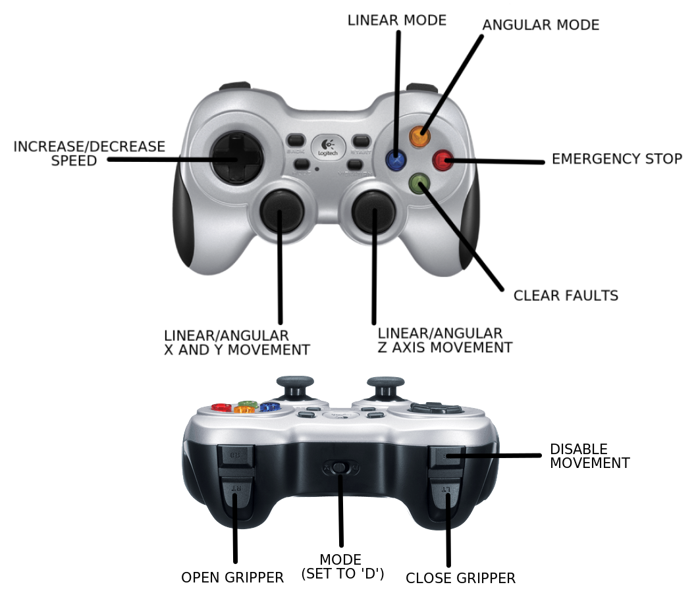

# kortex_joystick_demo

This package contains demo for using Logitech f710 gamepad to controll Panther robot and Kinova Kortex gen3 manipulator.

## Setup Kinova manipulator with Panther

1. Connect manipulator to your PC using Ethernet cable. 

2. Enable connection

On linux:

 - Go to: **settings -> network -> wired -> advanced -> IPv4**
 - Change IPV4 Method to Manual and set:
   - Address: **192.168.1.11**
   - Netmask: **255.255.255.0**
 - Restart network

3. Open Web browser and go to Kinova Kortex WebApp: [192.168.1.10](http://192.168.1.10) 

4. Open menu and go to **Network -> Ethernet**

5. Change IPv4 address to `10.15.20.4` and IPv4 gateway to: `10.15.20.1`. Save changes

**This will change dafault Manipulator IP adress from `192.168.1.11` to `10.15.20.4`. To access Kinova Kortex WebApp use new IP adress.**

6. Connect manipulator to RUTX11 router in Panther robot with Ethernet cable.

For more info about Kinova Kortex Gen3 refere to [gen3-robots](https://www.kinovarobotics.com/product/gen3-robots)

## Setup joy

Connect joy via nano USB receiver to NUC and make sure it is in **DirectInput Mode** (switch in front of the pad with letters **D** and **X**, select **D**).

To test if joy works, use `jstest /dev/input/js0`.
If the output is:

```
jstest: No such file or directory
```

See `ls /dev/input | grep js` and find your joy number. If it differs, edit `docker-compose.yaml` - add `gamepad_device:=jsX` to command in `kortex-ros` container, where `X` is your joy number. 

## Running demo on Panther robot

1. Access NUC via ssh

```bash
ssh husarion@10.15.20.3
```

default password is `husarion`

2. Clone this repo

```bash
cd ~/husarion_ws/src/
git clone https://github.com/husarion/kortex_joystick_demo.git
```

3. Setup gamepad according to [Setup joy](#setup-joy)

4. Setup virtual desktop

```bash
cd kortex_joystick_demo/
. ./kortex_joystick_demo/scripts/setup_virtual_desktop.sh
```

5. Launch demo

```bash

docker compose -f compose.panther-kinova.yaml up
```

After successful launch open Web browser and go to [10.15.20.3:8080](http://10.15.20.3:8080/vnc_auto.html). Enter password (default `husarion`) and you should see RViz and Panther with manipulator.

## Controlling Kinova manipulator

By default, after successful launch manipulator will be controlled by gamepad. To start driving and disable manipulator **ENABLE MOVEMENT** (**LB** button). To switch back to using manipulator press **ENABLE MOVEMENT** (**A** button).

### Manipulator button mapping

|  Button  |      Function      |
|:--------:|:------------------:|
|   `LB`   |   disable movement |
|   `LT`   |    close gripper   |
|   `RT`   |    open gripper    |
|   `B`    |   emergency stop   |
|   `A`    |   enable movement  |
|   `X`    |    linear mode     |
|   `Y`    |    angular mode    |
|   `UP CROSS KEY`    |    increase speed    |
|   `DOWN CROSS KEY`  |    decrease speed    |



To move manipulator use sticks.
By default, cartesian linear/angular movement in `X` and `Y` are held by left stick and linear/angular `Z` movement is controlled with right stick.
To switch between **linear** and **angular** mode use **X** and **Y** buttons. 

It is advised to put manipulator in **STOP** mode (**B** button) when not using it (e.g. when driving). To exit this mode use **CLEAR FAULTS** (**A** button).

## Controlling robot

### Robot button mapping

|  Button  |      Function      |
|:--------:|:------------------:|
|   `LB`   |   enable driving   |
|   `RB`   | slow driving mode  |
|   `RT`   |  fast driving mode |

If neither `RB` nor `RT` is pressed, the robot operates in *regular* driving mode.

To drive robot use sticks.
By default, linear `X` and `Y` are held by the right stick. Angular `Z` is controlled with the left stick.